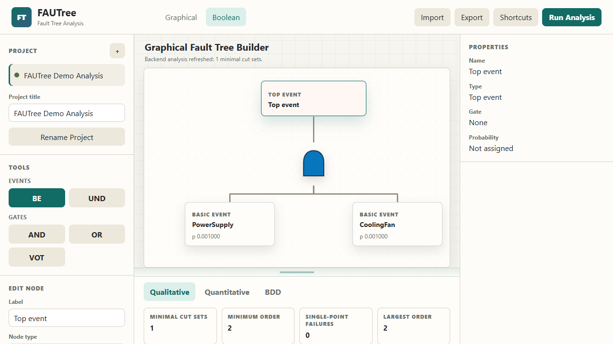

# FAUTree

FAUTree is a web-based Fault Tree Analysis (FTA) platform that combines graphical modeling, Boolean expression construction, and advanced analysis capabilities within a unified environment.



## Features

* Interactive graphical fault tree editor
* Boolean expression builder and conversion to fault trees
* Import/export support for `.fautree.json` projects and `.sbe` files
* Qualitative analysis (Minimal Cut Sets)
* Quantitative analysis
* Binary Decision Diagram (BDD) generation and visualization
* Integrated project management and analysis workflow

## Live Demonstration

Coming soon at:

https://fautree.com

A public demonstration of the platform will be available through the link above.

## Technology Stack

* Frontend: HTML, CSS, JavaScript
* Backend: Python
* Analysis Engine: Fault Tree Analysis, Minimal Cut Set generation, BDD processing

## Project Structure

```text
frontend/    Web-based user interface
backend/     Analysis engine and API server
examples/    Sample projects and SBE examples
docs/        Architecture notes and roadmap
scripts/     Development and startup scripts
```

## Development Setup

Detailed development and local execution instructions are available in the `/docs` directory.

## Status

FAUTree is under active development and continuous improvement.

## Related Publications

FAUTree is connected to research on fault tree analysis, Binary Decision Diagram (BDD) conversion, and minimal cut set computation, including the following publications:

* Mahdi Dibaei, Kai-Steffen Hielscher, and Reinhard German, "A Heuristic Variable Ordering Approach for Fault Tree Conversion to Binary Decision Diagram," 2024 6th International Conference on System Reliability and Safety Engineering (SRSE), pp. 301-307, IEEE, 2024. DOI: [10.1109/SRSE63568.2024.10772497](https://doi.org/10.1109/SRSE63568.2024.10772497)
* Mahdi Dibaei, Anna Arestova, Kai-Steffen Hielscher, and Reinhard German, "A Novel Method for Computing Minimal Cut Sets of Variant-Rich Systems in Fault Tree Analysis," 2023 7th International Conference on System Reliability and Safety (ICSRS), pp. 481-487, IEEE, 2023. DOI: [10.1109/ICSRS59833.2023.10381472](https://doi.org/10.1109/ICSRS59833.2023.10381472)

## Intellectual Property Notice

FAUTree is licensed under the GNU Affero General Public License v3.0 (AGPL-3.0-or-later).

Copyright © 2026 MAhdi Dibaei Asl.

## Contact

For academic collaboration, demonstrations, or licensing inquiries, please contact:

Mahdi Dibaei Asl
Friedrich-Alexander-Universität Erlangen-Nürnberg (FAU)

Email: [mahdi.dibaei@fau.de](mailto:mahdi.dibaei@fau.de)
